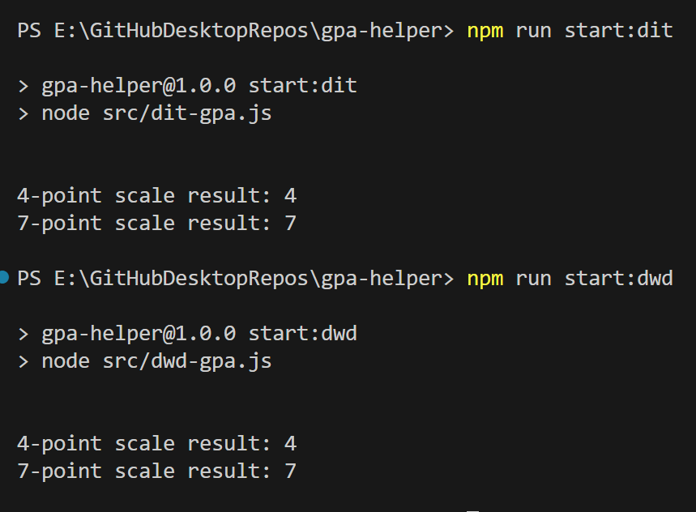

# gpa-helper
 
For Coder Academy.

Edit the file relevant to your bootcamp and its diploma.

## Picking the right file


### Bootcamps that began before July 2024

The original bootcamp diploma.

The course contains 8 subjects mapped to 3 terms, and each subject is worth 6 points.

You'll want to edit the `src/dit-gpa.js` file, and run the `npm run start:dit` command in your terminal.

### Bootcamps that began during or after July 2024

We moved to a new diploma! The Diploma of Web Development!

This has a different number of subjects in the diploma, and those subjects are worth a different amount of diploma credits.

The course contains 6 subjects mapped to 2 terms, and each subject is worth 8 points. 

You'll want to edit the `src/dwd-gpa.js` file, and run the `npm run start:dwd` command in your terminal.

## Editing the file

Each file contains this object:

```js
let subjectResults = {
	hd: 8,
	d: 0, 
	c: 0,
	p: 0,
	f: 0
}

```

Simply change the numbers of each key to match how many subjects you had each overall grade in.

For example, if you had 3 subjects with an overall grade of High Distinction, then you will put `hd: 3,` in that object.

Keep in mind: the total of the numbers put into this object should not be greater than the number of subjects in your bootcamp's diploma.

- Diploma of Information Technology: 8 subjects
- Diploma of Web Development: 6 subjects

There is no validation or sanitisation run in this project at this time - if you can't calculate a valid maximum number here, it's probably best that you don't share your GPA.

## Run the file

Depending on which bootcamp you're from, your command will be different:

- Diploma of Information Technology: `npm run start:dit`
- Diploma of Web Development: `npm run start:dwd`

This will give you a terminal output such as:



